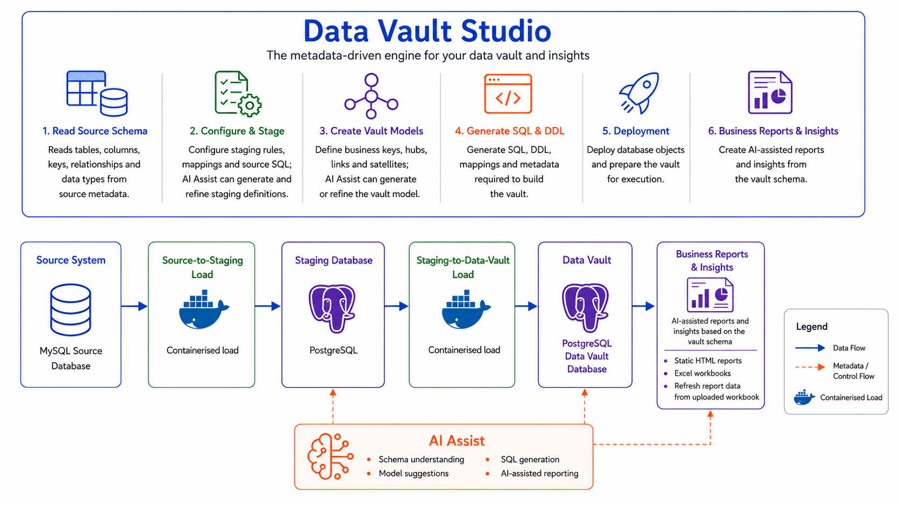

# Millersoft Data Vault Studio

Millersoft Data Vault Studio helps you turn a PostgreSQL, MySQL, or external SQL Server source database into a Data Vault design.

You can use it to:

- connect to a source database and a PostgreSQL target;
- choose which tables and columns to include;
- prepare the staging layer;
- design Hubs, Links, Satellites, and Link Satellites;
- generate the staging and Data Vault SQL;
- create the metadata spreadsheet used by the loading engine;
- check the design before deployment;
- deploy the files, then move to the Data Vault Hub to start and monitor the data-loading engine.

The Studio can also be used without starting the engine. You can build and review a complete design, download the SQL and spreadsheet, and hand them over for deployment later.

---

## General Data Vault Studio Architecture




---

## Before you start

For the Studio itself, you need:

- Node.js 18 or newer;
- npm;
- a modern web browser.

For deployment and data loading, you also need:

- the main Millersoft Data Vault project;
- Docker and Docker Compose;
- network access to the source and target databases.

AI Assist is optional. **Detect Hash Keys** and **Detect Vault Tables** work without an API key.

Demo mode reads its locked container credentials from the project-root
`.env` file:

- `SOURCE_PASSWORD` — packaged MySQL/Sakila password;
- `DB_USER` — packaged PostgreSQL target username;
- `VAULT_PASSWORD` — packaged PostgreSQL target and service-role password.

Studio masks passwords. **Apply All** synchronises `SOURCE_PASSWORD` from the
source connection. When the selected deployment target is native PostgreSQL,
it also synchronises the existing `POSTGRES_BOOTSTRAP_USER`,
`POSTGRES_BOOTSTRAP_PASSWORD`, and `VAULT_PASSWORD` values from the target
connection. Internal `DB_*` settings remain administrator-controlled and are
never changed by Studio. Restart or recreate affected containers after changing
runtime credentials.

---

## Start the Studio

Open a terminal in the `data_vault_studio` folder and install dependencies:

```bash
npm install
```

Start the same Studio application in either runtime profile:

```bash
# Normal startup — production mode is the default
npm start

# Explicit production mode (equivalent to npm start)
npm start -- --mode=production

# Locked demonstration environment
npm start -- --mode=demo
```

Convenience aliases are also available:

```bash
npm run start:demo
npm run start:production
```

The runtime flag affects only Studio defaults, field locking, and the supported
connection choices. It does not change `start.sh`, Compose files, deployment
SQL, or model-generation logic.

Then open:

```text
http://127.0.0.1:8420/
```

---

# Recommended workflow

Work through the five numbered tabs from left to right:

1. **Connections** — configure the source and choose MySQL, SQL Server, Internal PostgreSQL, or PostgreSQL as the deployment target.
2. **Tables** — choose the source tables and columns you want to use.
3. **Staging** — define the columns and keys that will be produced in staging.
4. **Vault model** — review and edit the Hubs, Links, and Satellites.
5. **Export & Deploy** — validate, download, and deploy. When deployment is current, continue to **Data Vault Hub** to start and monitor the engine.

You can go back to an earlier tab at any time. Step navigation always opens the
destination at the top of the page, including the Back and Next buttons at the
bottom of long Tables and Staging pages. Changes made to selected tables or
staging columns may affect the Vault model, so run the Integrity Checks again
after making changes. Vault and Export remain unavailable until every included
table has a generated staging hash column.

---

# Step 1 — Connections

The active runtime profile is shown at the top of the page. Demo and production
use the same connection, modelling, deployment, and reporting code.

## Demo mode

Demo mode is the existing self-contained evaluation environment:

- Source is locked to the packaged MySQL Sakila database.
- The Data Vault engine is locked to the internal PostgreSQL container.
- The user may keep native PostgreSQL storage or enable JDBC FDW storage.
- When FDW is enabled, the physical target is locked to MySQL database/schema
  `datavault` with the Sakila account.
- Source, PostgreSQL, physical-target, and FDW fields are visible for clarity
  but the demo-controlled values cannot be edited.

Passwords are always rendered as password inputs rather than readable text.

## Production source

Production mode removes the demo-source option. Choose PostgreSQL, MySQL, or
SQL Server and enter the external source host, port, database/schema, username,
and password. SQL Server is always external and is never started or packaged by
Studio. The source credential is independent of any physical FDW target
credential.

MySQL and SQL Server sources show a JDBC-driver check and fetch action because
the Hop engine requires the corresponding jar in `jdbc-drivers/`. SQL Server
source introspection also requires the Node `mssql` package installed by
`npm install`. The SQL Server path currently uses SQL authentication and
encrypted connections with trusted server certificates; Windows integrated
authentication is not configured by this release.

## Deployment target

Production shows four target choices:

- **MySQL** — the packaged PostgreSQL service remains the Hop engine and metadata
  store; core Hub, Link, Satellite, and Link Satellite tables are stored in the
  selected MySQL database through the existing JDBC gateway workflow.
- **SQL Server** — the same packaged PostgreSQL gateway is used, with core Vault
  tables stored in the selected external SQL Server database.
- **Internal PostgreSQL** — all staging, metadata, support, and core Vault tables
  are native objects in the packaged PostgreSQL container.
- **PostgreSQL** — all objects are deployed natively to the selected external
  PostgreSQL database. The external metadata bootstrap is run before the
  vault-specific `pdi_meta` records are generated by the GUI.

MySQL and SQL Server still use the existing ordered physical-target and gateway
deployment logic; the target list intentionally hides that implementation
detail. SQL Server remains external and no SQL Server container is created.

Studio-managed `start.sh up` layers `docker-compose.studio.yaml` over the base
Compose file by default. That override mounts `docker/studio-skip-ddls.sql`
over `03-ddls.sql`, so a fresh internal PostgreSQL volume cannot create
generated staging or Data Vault tables before **Export & Deploy** runs. Use
`--build` to opt into the packaged DDL instead. MySQL and SQL Server add
`docker-compose.fdw.yaml` as a third layer for the FDW image and JDBC drivers;
the DDL mask remains owned by the Studio override.

For native PostgreSQL, enter the host, port, database, username, and password.
Apply All writes those credentials to the existing external-bootstrap variables
before running the established metadata-bootstrap flow. The bootstrap script
itself is unchanged; after it completes, the GUI generates and applies the
vault-specific `pdi_meta` rows.

## Studio Plus default

Studio Plus follows the actual data location and uses the credentials supplied
on Connections:

- internal PostgreSQL with native storage → internal PostgreSQL target;
- internal PostgreSQL with FDW → physical storage target, including an
  external MySQL or SQL Server target;
- external PostgreSQL → external PostgreSQL target.

Deployment remains exclusively on **Export & Deploy**.

# Step 2 — Tables

Use this tab to choose the source data that will be available to the rest of the design.

## Import the source structure

After connecting the source, select **Detect Source Tables** to import its tables,
columns, primary keys, and source nullability. As part of the same action, the
Studio checks source PK and `NOT NULL` columns for SQL nulls and blank or
whitespace-only values. It performs one aggregate scan per relevant table and
returns counts only; source values are not copied into the Studio or sent to AI
Assist.

You can also paste or import a source definition manually. Manually entered
schemas follow their declared nullability until you use the table-level
**Profile table** action.

## Include or exclude tables

Only included tables are used in Staging and the Vault model. Live detection
lists database views in a separate **Views** section and leaves them unselected
by default; include a view only when it is intentionally acting as a source.

Use the table controls to:

- include or exclude a table;
- review primary and foreign keys;
- review approximate row counts;
- profile a table when needed.

## Select columns for staging

Each source column has a **Stage** checkbox.

- Checked: the column is available in staging and to the Vault modeller.
- Unchecked: the column is deliberately left out of staging and the Vault design.

This is the main control for excluding sensitive, unused, or unwanted columns.

## Staging names

The Studio keeps the original source name for reading the source database and creates a PostgreSQL-safe staging name for the target.

For example:

```text
Source name:  customer-name
Staging name: customer_name
```

Review any warnings about duplicated or invalid staging names before continuing.

# Step 3 — Staging

Staging is the prepared version of the source data used by the Data Vault load.

The columns selected here are the source of truth for the Vault model.

Each included source table is shown as a collapsible card. Use the card checkbox or **Deselect Tables** to remove tables from Staging without returning to Step 2.

The load group is fixed to the default value `2000` in this workflow.

## Column selection

The **Stage** checkboxes are the same settings shown on the Tables tab. A column unticked here is also removed from the Vault design.

## Key derivations

Key derivations create the business-key and hash columns used by Hubs and Links.

The list shows:

- the source column or columns;
- the target Hub;
- the relationship role;
- the generated output name;
- whether the output is a hash, business key, or both.

For example:

```text
language_id → Hub: language → Role: language
            → hash_language_id
```

Use **Add** to create a derivation manually. The output name is generated and checked for collisions.

## Detect Hash Keys

On the Staging tab, **Detect Hash Keys** adds staging key derivations only. It does not build or change the Vault model.

It uses declared primary keys first, foreign keys for relationships, and column-name conventions only when declared relationships are unavailable. Composite keys remain together in source-column order. The detection is deterministic and does not require AI.

## AI Assist

AI Assist can suggest staging key choices and relationship roles. The Studio checks the result against the imported database relationships before applying it.

AI suggestions are not accepted blindly. Known foreign keys and the Studio's validation rules take priority.

## SQL and DDL previews

Each table shows:

- **Staging SQL override** — the query used to read and prepare the source table;
- **Staging DDL** — the PostgreSQL table definition that will receive the data.

Generated Staging and Data Vault DDL also creates an idempotent PostgreSQL
index for every generated hash column. This includes Hub and Link keys,
relationship hashes, Satellite parent keys, and hashdiff columns.

Review these previews when you change columns or key derivations.

### Wizard navigation scroll

The designer scrolls inside the `<main>` application container. Moving between
wizard steps resets that container, plus the document fallback, to the top after
rendering. The missing-hash warning shown on the first Staging visit is not the
cause of the old retained position; after the fix it is simply visible near the
top of the newly opened page.

### Empty values and nullability

**Detect Source Tables** automatically profiles every source PK and `NOT NULL` column,
counting SQL nulls and blank/whitespace-only values separately. This matters
because the engine can normalise blank source fields to SQL `NULL`, even when
the source metadata declares the column `NOT NULL`. The **Profile table**
button runs a manual check for every column and also calculates distinct values
for business-key assessment.

The initial staging DDL matches the source definition by default:

- primary-key columns are generated as `NOT NULL`;
- source columns marked non-nullable are generated as `NOT NULL`;
- source columns marked nullable remain nullable;
- an unprofiled column follows those source settings (for example, a manually
  pasted schema or an automatic table profile that could not be completed).

A saved live profile is the exception. If profiling finds a SQL null or a
blank/whitespace-only value, that staging column is generated as nullable so the
engine can land the row after blank-to-`NULL` normalisation. Derived hashes,
business-key helpers, and `tenant_id` remain nullable. Nullability is decided in
the initial `CREATE TABLE`; no `ALTER TABLE ... DROP NOT NULL` migration or
repair statements are emitted.

Automatic source-detection profiles are stored only for staging-DDL decisions
and are not shown on the Tables page. Selecting **Profile table** replaces them
with full row, distinct, null and blank counts and then shows the results beside
each column. Renaming a source column clears its saved profile because the
result no longer applies to that identifier.

## Integrity Check

Use the Staging **Integrity Check** to find included tables that still emit no
hash column. A business-key-only derivation does not satisfy this check.

## Confirm changes

Every included table must emit at least one hash column before you can
continue. Run **Detect Hash Keys** or use **AI Assist** to create them, or
deselect a table that should not be staged.

After reviewing the selected columns, detected keys, and SQL previews, select
**Confirm Changes**. The confirmation and **Next: vault model** buttons remain
disabled until the hash requirement is satisfied. Any later Staging edit
invalidates the confirmation, so the current state must be confirmed again
before continuing to the Vault model.

---

# Step 4 — Vault model

Use this tab to review and edit the Data Vault design.

At the top of the page, enter the Vault name and description used in the metadata spreadsheet.

The tab contains four views.

## Hubs

Hubs represent the main business entities and their stable business keys.

Examples include:

- Customer;
- Product;
- Employee;
- Contract.

A Hub can use a single key or an ordered composite key.

Review:

- the source table;
- the Hub name;
- the business-key columns;
- the generated Hub key and business-key output.

## Links

Links represent relationships between Hubs.

Examples include:

- Customer placed Order;
- Employee manages Employee;
- Product belongs to Category.

The Studio keeps relationship roles separate, so two references to the same Hub can still be distinguished, such as:

```text
billing_address
shipping_address
```

Relationship tables containing additional data can also create a Link Satellite.

## Satellites

Satellites store descriptive and changing attributes.

There are two types:

- **Hub Satellites** — describe a business entity;
- **Link Satellites** — describe a relationship.

For example, an order-product relationship might place `quantity`, `unit_price`, and `discount` in a Link Satellite.

Every selected descriptive staging column should appear in a Satellite unless it was explicitly excluded earlier.

## Diagram

The diagram provides a visual view of the Hubs, Links, and Satellites.

You can change the layout, fit the model to the screen, inspect an object, and download the diagram as an SVG file.

## Detect Vault Tables

On the Vault model tab, **Detect Vault Tables** builds a deterministic model from the imported keys. It can create Hubs, Links, Hub Satellites, and Link Satellites.

This is a good starting point when the source has reliable primary and foreign keys.

## AI Assist

AI Assist can propose grouping and naming for the Vault model. The Studio then completes missing selected attributes and applies its own relationship and validation rules.

Always review the result before deployment.

## Integrity Check

The Vault **Integrity Check** finds:

- included tables not represented in the model;
- selected staging columns not assigned to a Satellite.

## External core tables with jdbc_fdw

JDBC FDW is available only when the Data Vault engine target is the internal
PostgreSQL container. Enable it on **Connections**. Configure the physical
target and the container-side foreign-server route in the two sections that
appear there; the Vault-model tab contains modelling controls only.

The storage boundary is deliberately narrow:

- `hub_*`, `link_*`, `sat_*`, and `lsat_*` become PostgreSQL foreign tables;
- the corresponding physical tables live in the selected external target;
- every `*_err` table, staging object, metadata object, and verification view
  remains native PostgreSQL.

Hop continues to use the internal PostgreSQL connection. Export performs the
single ordered deployment: verify/create the PostgreSQL database, verify/create
the physical target, create physical core tables, create local support objects,
configure the FDW extension/server/role mappings, create foreign-table bindings
last, and smoke-test reads as both `data_vault` and `pdi_meta`.

The JDBC URL is the route visible from inside the PostgreSQL container. It may
use a Docker service hostname while the Studio-visible physical target uses a
host address such as `localhost` or `host.docker.internal`.

# Step 5 — Export & Deploy

Use this tab to check the complete design and prepare it for use.

## Validation

The validation panel lists design issues that must be resolved before export.

Typical issues include:

- duplicate output names;
- missing Hub or Link keys;
- selected staging columns not assigned to a Satellite;
- invalid table or column names;
- included tables or columns that are not represented in the Vault model.

## Deployment status

Select **Check status** to see which parts of the current design have already been applied.

Select **Apply all updates** to apply the outstanding items in order. Every run
first synchronises the allowlisted runtime secrets in `.env` and always
regenerates the metadata spreadsheet at the end, even when its existing file
cannot be content-diffed.

For a first deployment, this normally includes:

- target schemas and tables;
- metadata setup;
- the metadata spreadsheet;
- the source connection file;
- engine settings.

The project-root `.env` remains protected from generic file deployment. Studio
can update only the allowlisted runtime secrets described above; comments,
unrelated settings, internal `DB_*` values, and variable references are
preserved.

## Download files

You can download the generated files without deploying them:

- metadata spreadsheet;
- Staging DDL;
- Data Vault DDL;
- metadata SQL;
- source connection file;
- engine settings.

This is useful when another team manages the database or deployment process.

## Update an existing Vault

Use **Diff against target** after changing an already-deployed design.

The Studio compares the new DDL with the target and generates SQL for missing
tables, columns, and hash indexes. Type differences are reported for review
rather than changed automatically.

It can also identify obsolete Link Satellite Hub columns created by older
Studio DDL. Those removals are listed explicitly and require confirmation
before execution.

## Continue to the Data Vault Hub

Before starting the engine:

1. resolve all validation errors;
2. apply the current updates until every deployment item shows **Deployed ✓**;
3. confirm that the source and target connections work.

The Export & Deploy page does not start the engine. Select **Open Data Vault Hub** after deployment is current.

---

# Data Vault Hub

Use **Data Vault Hub** to start the engine and review the operational status of the Vault. The Hub saves the current spreadsheet, source connection, and engine settings before starting a run; it never rewrites `.env`.

The run dashboard intentionally includes only **Data Vault** and **Test Staging** run records. **Test Staging** is presented as **Staging** because that run owns the usable staging job counts. The separate **Staging** and **Test Staging Files** run types are excluded from dashboard totals, charts, and recent-run rows.

Use **View engine logs** to follow the run and diagnose connection or loading errors.

Depending on the available metadata, it can show:

- recent runs and their status;
- rows loaded;
- tables with zero rows;
- loading errors;
- error tables containing rejected records.

Use **Verify latest load** in **Post-run verification** to run checks against
the most recent load. Verification progress and completed results remain
visible when the Hub refreshes or re-renders; they are not cleared by the
normal dashboard polling cycle.

---

### Runtime profiles and FDW credentials

`npm start` defaults to production mode. Use `npm start -- --mode=demo` only
for the locked demonstration environment. `npm start -- --mode=production`
remains supported when an explicit production flag is preferred. The
server injects the selected profile into the same browser application and
exposes it through `/api/runtime-profile`.

In demo mode, the physical MySQL target deliberately reuses the locked Sakila
account. In production mode, the physical target uses the username/password the
user enters for that target; it never silently reuses the source credential.
That physical-target account creates or maintains the core tables and is stored
in the specific `data_vault` and `pdi_meta` FDW user mappings.

The account must be able to create or open the output database and create,
alter, index, read, and write the core tables. For customer-managed targets, an
administrator must grant those privileges before deployment.

The packaged MySQL demo grants the existing Sakila account privileges on the
future `datavault.*` namespace from
`mysql-init/99-fdw-demo-target-grant.sql`. The file does not create the
database, and `start.sh` does not contain a MySQL administrator login.


## v6.4 runtime-role correction

FDW live checks now run under PostgreSQL role `data_vault`, matching Hop. The Studio deployment login is tested with `SET LOCAL ROLE data_vault` during preflight and deployment; no user mapping is created for the administrative login.


## v6.5 pdi_meta FDW mapping correction

The Data Vault engine's metadata procedures read the core Vault tables while connected
as PostgreSQL role `pdi_meta`. External mode now creates a second specific JDBC FDW user
mapping for `pdi_meta`, using the same physical-target username/password as `data_vault`,
and grants both roles `USAGE` on the foreign server. Preflight verifies that the Studio
deployment login can assume both service roles. Deployment and status checks open one
foreign table as each role, so a missing `pdi_meta` mapping is detected before the engine
runs. No `PUBLIC` user mapping is created.

## v6.6 deployment UI

Deployment is performed only from **Export & Deploy**. The packaged demo locks the selected physical target fields and masks demo passwords. Later releases moved the FDW server configuration from the Vault page to the end of Connections and corrected Studio Plus to follow the physical target.

## v6.7 Studio Plus physical-target default

Studio Plus defaults from the physical Target entered on Connections. External mode connects directly to the selected target database with its configured target username/password; the packaged demo therefore uses MySQL `datavault` as `sakila`. Normal mode uses the PostgreSQL Target connection.

## v6.8 compact deployment status

Export shows three compact deployment stages: **Physical target**, **PostgreSQL gateway**, and **Engine and project**. Each stage has one status pill and one summary. Current stages remain collapsed; stages requiring attention open automatically. Expanding a stage exposes the same detailed checks and individual deployment actions as before. Deployment ordering and behaviour are unchanged.


## v7.0 runtime profiles and Connections-owned FDW setup

One Studio build now supports `demo` and `production` npm-start modes. Demo keeps
the existing packaged services and locked values. Production removes the
MySQL-demo source option, supports user-defined PostgreSQL and MySQL sources,
and offers either internal PostgreSQL (native or FDW) or external PostgreSQL
(native only). The FDW server fields now live at the end of Connections. A
separate physical-target driver check appears when the source and non-PostgreSQL
FDW target use different database types.


## v7.1 external SQL Server support

Production mode now supports SQL Server in two external positions: as a source
database and as the physical core-table target behind the internal PostgreSQL
JDBC FDW gateway. SQL Server is never offered as a packaged service or direct
Data Vault engine target.

The Studio adds SQL Server connection tests, schemas, PK/FK/table introspection,
profiling, Hop `MSSQLNATIVE` metadata, Unicode-safe SHA-256 override generation,
remote core-table DDL/status/deployment, JDBC-driver checks, and Studio Plus
reporting. SQL Server target deployment uses the Target credentials from
Connections. The selected target schema must match the SQL login user's default
schema.

Run `npm install` after applying this release so the companion server can load
the new `mssql` dependency. A live SQL Server plus jdbc_fdw route was not
available in the packaging environment; certify the intended SQL Server
version, authentication policy, JDBC driver, and network route before a
production rollout.


## v7.1.1 target and environment hotfix

The Connections target selector is simplified to MySQL, SQL Server, Internal
PostgreSQL, and PostgreSQL. The existing MySQL and SQL Server JDBC gateway route
is retained. Apply All now synchronises `SOURCE_PASSWORD`, synchronises native
PostgreSQL bootstrap credentials, and always redeploys the mapping workbook.
The existing external PostgreSQL bootstrap script is unchanged. The GUI continues
to invoke that prerequisite flow and then applies the vault-specific `pdi_meta`
records itself. Studio-managed internal PostgreSQL starts apply the no-op
`03-ddls.sql` override by default; `--build` opts into the packaged DDL.
FDW starts add the FDW packaging override on top.
